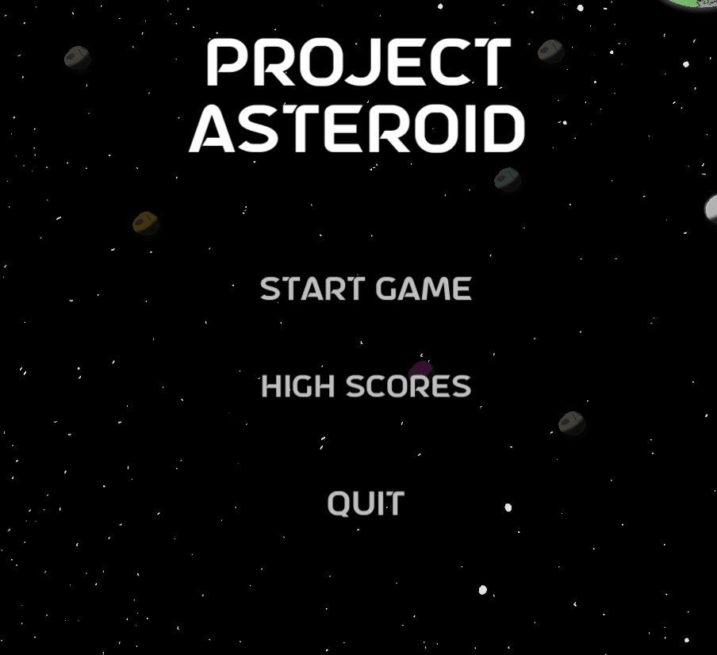
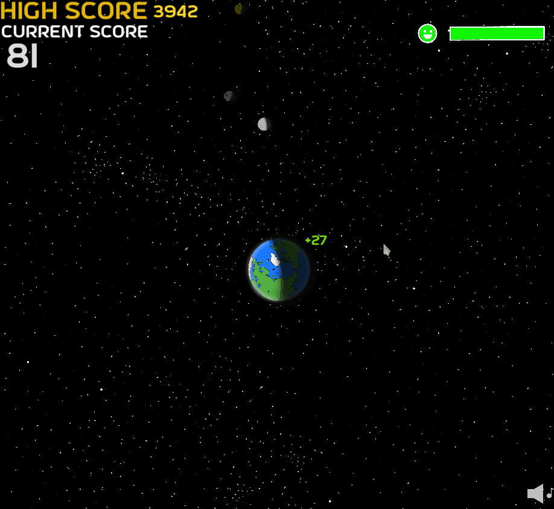
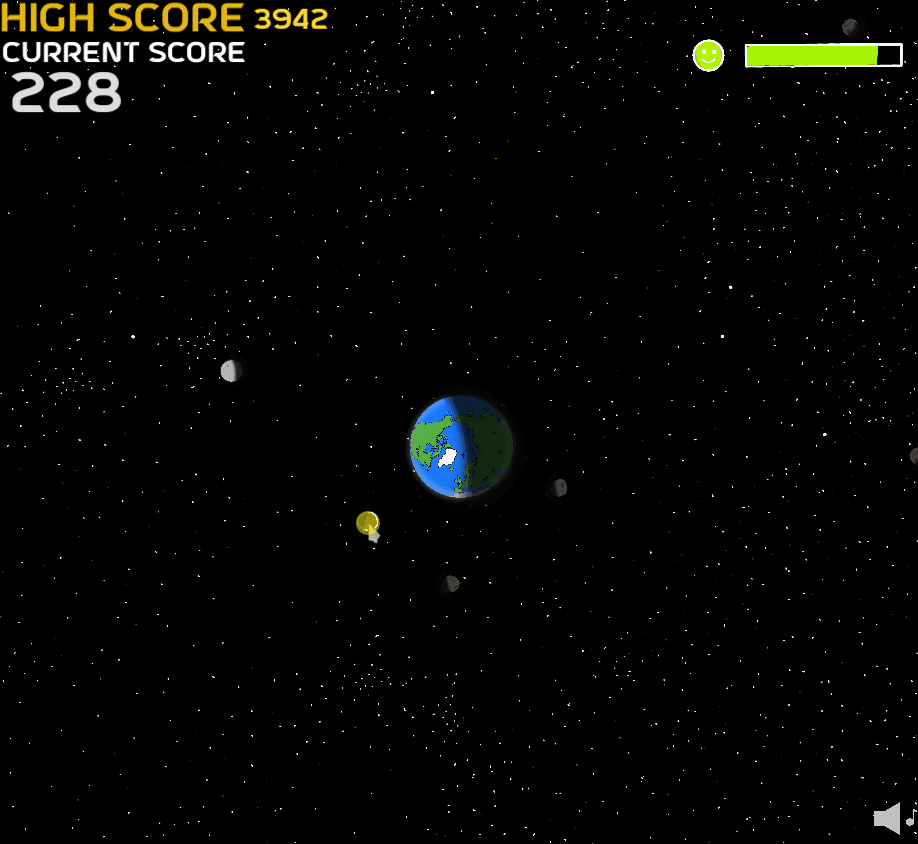

# **Project ASTEROID**
 
## **Description*
---
Project ASTEROID is a small arcade-like game where you have to protect Earth from incoming asteroids!! You can use your cursor to grab (click) and drag the asteroids out of orbit or keep them in orbit for extra points.

Be careful though!! If you keep them in orbit they will slowly fall to Earth after some time!!

## **Table of Contents**
---
1. [Installation](#installation)
2. [Usage](#usage)
3. [Credits](#credits)
4. [License](#license)

## **Installation**
---
Currently the best way to install and download the game is by downloading the repository here on GitHub and opening the game up in Unity- however I am working on creating an executable to run more simply soon...

## **Usage**
---
To play Project ASTEROID all you need to do is start up the game and click `START GAME` on the start menu.

As shown in the above animation, you have the options to view the highscores, quit game or start game. Once you start the game you will see Earth from above, with the moon orbiting nearby.

Your job at this point is to prevent asteroids from making contact with Earth's surface. You can do this simply by clicking down on the asteroids as they approach, but make sure to hold on so you can drag them away from Earth.

You may also notice in the above animation that there are numbers like `+27` or `+4` popping up. These are to represent the points you are gaining as you play. 

The ways to gain points in Project ASTEROID comes from two places:

* Earth points

        You gain Earth points for keeping Earth safe. The health bar on the top left shows you how much damage Earth has taken. The higher Earth's health, the more points you will receive. Earth's health **CANNOT** be replenished.

* Asteroid points

        The other way to gain points is from asteroids themselves. If you place asteroids into either Earth's or the Moon's orbits you will gain points for the Earthlings as they mine them for resources.

*There are also rare asteroids which provide increased rewards/points for farming them.*

The game ends when Earth has no more health left.

## **Credits**
---
This game was solely developed by [coderbennett](https://github.com/coderbennett). I created all the graphics, music and scripts. I used C# as the coding language for this project as well.

This game also wouldn't be possible without [Unity](https://unity.com/).

## **License**
---
This project is licensed with Apache 2.0. To view the license view the linked [LICENSE](LICENSE.txt) file.
